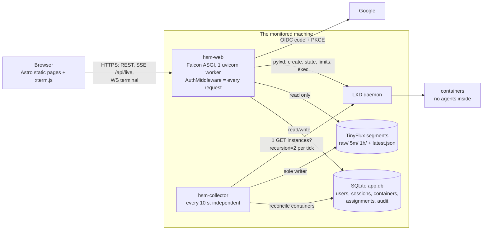

# Hobby Server Monitor

An admin dashboard and control panel for **LXD containers on one old Linux
machine** that is used as a test server. It runs *on* the machine it
monitors, so it is built to stay small:

- **Two processes:**
  - a **collector**, which polls LXD every 10 s and writes TinyFlux history;
  - a **web API**, which serves Falcon ASGI plus the static Astro dashboard.
- **Storage:** SQLite for users and permissions, TinyFlux for metrics.
- **No Node.js at runtime and no agents inside containers.**

| Role | Can do |
|---|---|
| **Admin** | Create, update (limits, owner), start, stop, restart, freeze and delete containers. Invite and revoke users, set roles and quotas, grant container access. Open a terminal anywhere. View usage accounting and the audit log. |
| **Container user** | See live metrics and history **only for containers they own or were granted**, see their own quota, and run commands or open a terminal in those containers. Asking for any other container returns `403`. |

Contents:
- [Setup](#setup)
- [Architecture](#architecture)
- [Data model](#data-model)
- [API reference](#api-reference)
- [Security notes](#security-notes)
- [Configuration](#configuration)
- [Tests](#tests)

`REPORT.md` holds the decisions, measurements and known limitations.

---

## Setup

From a fresh Ubuntu 24.04 machine (or WSL2 Ubuntu) to a running dashboard.

### 1. Packages

```bash
sudo apt update && sudo apt install -y git python3 python3-venv curl
# Node.js >= 18.20 is needed ONLY to build the dashboard (any machine works):
mkdir -p ~/.local && curl -fsSL https://nodejs.org/dist/v22.12.0/node-v22.12.0-linux-x64.tar.xz | tar xJ -C ~/.local --strip-components=1   # adds ~/.local/bin/node
```

### 2. LXD

```bash
sudo snap install lxd
sudo lxd init --minimal                      # 'default' dir pool + lxdbr0 bridge
sudo usermod -aG lxd "$USER" && newgrp lxd   # dev only; read "Security notes" first
lxc launch ubuntu:24.04 test1                # something to look at
```

**Optional, recommended:** add a pool that can enforce disk quotas. The default
`dir` pool cannot limit or report per-container disk; btrfs can.

```bash
lxc storage create hsm-btrfs btrfs size=10GiB
```

The create form lists every pool it finds. On `dir` pools the disk slider is
hidden and usage shows "n/a".

### 3. Google OAuth credentials

1. Go to <https://console.cloud.google.com/> and create or select a project.
2. Open **APIs & Services → OAuth consent screen**. Choose **External**, fill in
   the app name and support email, and add yourself (and any testers) under
   **Test users**. Scopes: `openid`, `email`, `profile`.
3. Open **Credentials → Create credentials → OAuth client ID → Web application**.
   - **Authorised redirect URI:** `http://localhost:8000/auth/google/callback`.
     It must equal `GOOGLE_OAUTH_REDIRECT_URI` exactly.
   - **Authorised JavaScript origins:** leave empty. The exchange happens on
     the server.
4. Copy the client ID and secret.

### 4. Configure

```bash
git clone <this repo> hobby-server-monitor && cd hobby-server-monitor
cp .env.example .env && chmod 600 .env
python3 -c "import secrets; print(secrets.token_hex(32))"     # -> SESSION_SECRET
$EDITOR .env    # GOOGLE_OAUTH_CLIENT_ID/SECRET, SESSION_SECRET, BOOTSTRAP_ADMIN_EMAIL
```

### 5. Install, initialise, build

```bash
python3 -m venv .venv
.venv/bin/pip install -r backend/requirements-dev.txt
(cd backend && ../.venv/bin/python -m hsm.init_db)   # creates data/app.db + data/metrics/, invites the bootstrap admin
(cd dashboard && npm ci && npm run build)          # -> dashboard/dist (static files)
```

`init_db` is idempotent: it applies numbered migrations (`PRAGMA user_version`)
and can be re-run safely. `python -m hsm.init_db --check` exits 1 if
migrations are pending.

### 6. Run (development)

Use two terminals:

```bash
cd backend && ../.venv/bin/python -m hsm.collector   # background collector (keep it running)
cd backend && ../.venv/bin/python -m hsm.web         # http://localhost:8000
```

Open <http://localhost:8000> and sign in with the `BOOTSTRAP_ADMIN_EMAIL`
Google account. Invite other users on the **Admin** page. Only invited emails
can sign in.

> If port 8000 is taken (on Windows, Docker Desktop often holds it), set
> `BACKEND_PORT=8001` and use `http://localhost:8001/auth/google/callback`
> both in `.env` and in the Google console.

### 7. Run as a service (production, survives reboots)

```bash
(cd dashboard && npm ci && npm run build)
sudo deploy/install.sh        # first run copies .env.example to /etc/hobby-server-monitor/env and stops
sudo $EDITOR /etc/hobby-server-monitor/env   # set the values; COOKIE_SECURE=true behind HTTPS
sudo deploy/install.sh        # installs to /opt, creates the 'hsm' user, runs init_db, enables both units
```

`install.sh` does the following:
1. Creates the `hsm` system user and adds it to `lxd`.
2. Copies the code to `/opt/hobby-server-monitor` (root-owned, read-only to the
   service) and builds a venv there.
3. Keeps state in `/var/lib/hobby-server-monitor` (mode 0700, owned by `hsm`).
4. Enables `hsm-collector.service` and `hsm-web.service`, both
   `WantedBy=multi-user.target`.

So after a reboot, systemd starts the collector once LXD is up and then the
web API. The collector uses `Restart=always`, the web API
`Restart=on-failure`. Put a TLS reverse proxy (Caddy or nginx) in front of
`127.0.0.1:8000`, and forward WebSocket upgrades for
`/api/containers/*/terminal`.

---

## Architecture



**How the parts talk to each other**

- **Collector to LXD.** Each tick makes *one* call
  (`/1.0/instances?recursion=2`), which returns every container with its
  state. For each container it computes CPU % and network rates from the
  previous sample, then:
  - appends a raw point to the current hourly TinyFlux file;
  - folds the sample into the 5-minute and 1-hour rollups;
  - reconciles the `containers` table (renames, out-of-band deletes);
  - atomically rewrites `latest.json`.

  If LXD is down it records `lxd up=0`, keeps the last values marked stale,
  and retries on the next tick.
- **Browser to web, live data.** Each page opens one `EventSource` on
  `/api/live`. The web process has **one** watcher, which checks the mtime of
  `latest.json` once a second and runs only while at least one browser is
  connected. It pushes each new snapshot to every subscriber, filtered per
  user, and re-checks each subscriber's session on every push.
  - Cost per extra tab: one small SSE write.
  - Cost with no tabs: nothing.
  - The collector's cost doesn't change either way.
- **Browser to web, actions.** REST calls go through `AuthMiddleware`, then a
  resource, then pylxd (run in a worker thread). Creating a container returns
  `202` with a job id at once. A background task polls the LXD operation,
  records owner and limits when it finishes, and starts the container.
- **Terminal.** xterm.js opens a WebSocket to the web process, which bridges
  to LXD's exec websockets over the unix socket. It closes on idle timeout,
  logout, session expiry or revocation (re-checked every 5 s).
- **History.** The web process opens only the TinyFlux segments that overlap
  the requested range, read-only, and buckets them to at most 360 points.

**Layout**

```
backend/hsm/        config, db (schema + migrations), init_db, lxd (pylxd wrapper),
                    tsdb (TinyFlux tiers), quota, collector
backend/hsm/web/    app (route table), policy (authZ middleware), security, auth (OIDC),
                    containers, admin (users, usage, me), live (SSE), terminal (WS), static
backend/tests/      pytest: authn, authz, validation, quota, collector, live, terminal, lxd_live
dashboard/src/      pages: index, container, terminal, admin, usage, login, 404; scripts/*.ts
deploy/             hsm-collector.service, hsm-web.service, install.sh
```

---

## Data model

### SQLite (`backend/hsm/db.py`, schema v1 via `PRAGMA user_version`)

| Table | Columns | Notes |
|---|---|---|
| `users` | `id`, `email` (unique, NOCASE), `name`, `role` (`admin`/`user`), `status` (`invited`/`active`), `quota_cpus`, `quota_memory_mib`, `quota_disk_gib` (NULL = unlimited), `invited_by`, `created_at`, `last_login_at` | A row exists **only** if an admin invited the email (or it is the bootstrap admin). |
| `sessions` | `token_hash` (PK, sha256), `user_id` (FK, cascade), `csrf`, `created_at`, `expires_at`, `last_seen_at` | Server-side sessions. The cookie carries an HMAC-signed random token; only its hash is stored. |
| `containers` | `uuid` (PK = LXD `volatile.uuid`), `name` (unique), `owner_id` (FK, SET NULL), `cpus`, `memory_mib`, `disk_gib`, `status`, `created_by`, `created_at`, `last_seen_at` | Allocation cache used for quotas. The collector reconciles it with LXD every 10 s. |
| `assignments` | `user_id` (FK, cascade), `container_uuid` (FK, cascade), `granted_by`, `created_at` | Access grants, keyed by **uuid**, not name. |
| `audit_log` | `id`, `ts`, `actor_id`, `actor_email`, `action`, `target`, `detail`, `ip` | No foreign keys, so the trail outlives deleted users. |

**Renames and deletes.** Grants and ownership hang off the instance uuid.
- **Renamed** outside the tool (`lxc rename`): the collector updates `name`
  within one tick, and access follows the container.
- **Deleted while assigned:**
  - through the dashboard, the row is removed and grants cascade;
  - outside the tool, the collector notices the uuid is gone, removes the row
    (grants cascade) and audits `container_vanished`.
- **New container with an old name:** it has a new uuid, so it does **not**
  inherit the old container's grants.

### TinyFlux (`backend/hsm/tsdb.py`)

`TINYFLUX_DB_PATH` is a directory. Each tier is a set of time-segment files:

| Tier | Resolution | Segment file | Kept (default) | Measurement | Fields |
|---|---|---|---|---|---|
| raw | 10 s | `raw/YYYYMMDDHH.tinyflux` (hourly) | 6 h | `ct` | `cpu_pct`, `mem_used`, `disk_used`, `rx_bps`, `tx_bps`, `procs`, `running` |
| 5m | 5 min | `5m/YYYYMMDD.tinyflux` (daily) | 7 d | `ct5m` | `cpu_avg`, `cpu_max`, `mem_avg`, `mem_max`, `disk_used`, `rx_bytes`, `tx_bytes`, `procs_max`, `up_frac` |
| 1h | 1 hour | `1h/YYYYMMDD.tinyflux` (daily) | 30 d | `ct1h` | same as `ct5m` |
| raw | 10 s | (same files) | 6 h | `lxd` | `up` (1/0), `poll_ms`; tag `host` |

The tag on `ct`, `ct5m` and `ct1h` is `uuid` (LXD `volatile.uuid`), so
history survives a rename. `latest.json` is the newest full snapshot for the
live view, replaced atomically on every tick.

**Charts.** Ranges up to 6 h use the raw tier, 24 h and 7 d use 5m, and 30 d
uses 1h. Points are bucketed so a chart never gets more than 360.

**Retention** deletes whole segment files whose time span has expired. Nothing
is rewritten in place, so growth is bounded by tier size × retention. That's
about 13.6 MB for 10 containers (measured row size, see REPORT).

---

## API reference

All endpoints return JSON, except SSE, the WebSocket and static files.

- **Errors:** `{"detail": "...", "title": "..."}`.
- **Unauthenticated:** `401`.
- **Wrong role or no access:** `403`. An unknown or unassigned container name
  gives the same `403`.
- **Invalid input:** `422`.
- **Writes:** every non-GET needs the header `X-CSRF-Token` (from `/api/me`),
  and the `Origin` header must match the configured origin when the browser
  sends one.

Roles: **P** = public, **U** = any signed-in user, **C** = admin, owner or
assignee of `{name}`, **A** = admin.

| Method & path | Role | Request | Response |
|---|---|---|---|
| `GET /auth/login` | P | – | 303 to Google (state, nonce, PKCE S256) |
| `GET <redirect path>` (`/auth/google/callback`) | P | `code`, `state` | 303 to `/`, sets `hsm_session`, or 303 to `/login/?error=oauth\|unverified\|not_invited` |
| `POST /api/auth/logout` | U | – | 204; deletes the server-side session |
| `GET /api/me` | U | – | `{id, email, role, csrf, session_expires, quota, allocated, remaining}` |
| `GET /api/live` | U | – | SSE: `event: snapshot` `{meta, containers}` per collector tick; `event: expired` |
| `GET /api/containers` | U | – | `{meta:{ts, lxd_ok, collector_ok, error…}, containers:[…], jobs:[…]}`, filtered to what the caller may see |
| `POST /api/containers` | A | `{name, image, cpus, cpu_allowance, memory_mib, disk_gib, pool, network?, profiles, ephemeral, autostart, description, owner_id?, start}` | 202 `{id, name, status}` (job); 409 quota or name taken; 422 out of bounds |
| `GET /api/containers/options?owner_id=` | A | – | `{host, pools, networks, profiles, images, owner{remaining}, bounds{pool:{cpus,memory_mib,disk_gib}}, users}` |
| `GET /api/jobs/{job_id}` | A | – | `{id, name, status: running\|done\|failed, error}` |
| `GET /api/containers/{name}` | C | – | live sample + `{owner, allocated, pending, assigned (admin)}` |
| `PATCH /api/containers/{name}` | A | `{cpus?, cpu_allowance?, memory_mib?, disk_gib?}` | `{name, cpus, memory_mib, disk_gib}`; 409/422 over quota or host |
| `DELETE /api/containers/{name}` | A | – | 204 (stops if running, deletes, drops grants) |
| `POST /api/containers/{name}/state` | A | `{action: start\|stop\|restart\|freeze\|unfreeze}` | `{name, status}` |
| `PUT /api/containers/{name}/owner` | A | `{owner_id: int\|null}` | `{name, owner}`; 409 if over the new owner's quota |
| `GET /api/containers/{name}/history?range=` | C | `range` = `15m\|1h\|6h\|24h\|7d\|30d` | `{tier, step, start, end, points:[{t, …fields}]}` (≤ 360 points) |
| `POST /api/containers/{name}/exec` | C | `{command: str ≤ 4096}` | `{exit_code, stdout, stderr, truncated, duration_s, timed_out}` (30 s limit, 64 KiB output cap, 20/min) |
| `WS /api/containers/{name}/terminal` | C | binary frames: `0x00`+stdin, `0x01`+`{"cols","rows"}` | stdout bytes; closes 4401/4403/4408/4409/4429/4500 |
| `GET /api/admin/users` | A | – | `[{id, email, role, status, quota, allocated, containers}]` |
| `POST /api/admin/users` | A | `{email, role, quota:{cpus, memory_mib, disk_gib}}` | 201 user (invite) |
| `PATCH /api/admin/users/{user_id}` | A | `{role?, quota?}` | user |
| `DELETE /api/admin/users/{user_id}` | A | – | 204: revokes entirely (sessions and grants go; owned containers become unowned) |
| `PUT /api/admin/users/{user_id}/containers/{name}` | A | – | 204 grant |
| `DELETE /api/admin/users/{user_id}/containers/{name}` | A | – | 204 revoke |
| `GET /api/admin/audit?limit=&before=` | A | – | `[{id, ts, actor_email, action, target, detail, ip}]` |
| `GET /api/admin/usage?period=` | A | `1h\|24h\|7d\|30d` | `{host, allocated, unlimited_containers, users, containers:[consumption], tsdb}` |
| `GET /`, `/{path}` | P | – | static dashboard files |

---

## Security notes

### Threat model, in short

| Asset | Threat | Mitigation |
|---|---|---|
| Host (LXD = root) | Any web compromise or stolen admin session = host compromise | Narrow LXD surface: fixed config keys only, `security.privileged=false` and `security.nesting=false` forced, image allowlist, `limits.processes`. Admin-only lifecycle actions. Short revocable sessions. Audit everything. TLS + VPN/allowlist recommended. Two sandboxed systemd units. |
| Accounts | Strangers signing in | **Invite-only**: no user row means no access, and no row is created for strangers. The ID token is verified (JWKS signature, `iss`, `aud`, `exp`, `nonce`) and `email_verified` is required. |
| Sessions | Theft, replay after logout | HttpOnly + SameSite=Lax (+ Secure) cookie holding an HMAC-signed random token. Server-side row with 8 h absolute and 60 min idle expiry. Logout and revocation delete the row. The DB stores only the token's hash. |
| Writes | CSRF, cross-site WebSocket hijacking | Synchronizer token + Origin check on every non-GET, enforced centrally. WebSocket handshake rejected unless `Origin` matches. |
| Data of other users | IDOR / probing container names | `AuthMiddleware` resolves `{name}` to uuid and checks owner/assignee on every request. Unknown and forbidden names give the same 403. SSE and WebSocket re-check every tick or 5 s. |
| Inputs | Injection | Pydantic models with `extra="forbid"`. The name regex `^[a-z0-9-]{1,63}$` applies everywhere. Every slider bound is re-checked against **live** host capacity and quota. Parameterised SQL only. No host shell anywhere: pylxd + argv lists. 64 KiB body cap. |
| Availability | Fork bombs, runaway output, floods | `limits.processes=2000`, CPU and memory limits. Exec output capped while streaming and killed after 30 s. Rate limits on login, exec and terminal. Terminal caps of 2 per user and 8 total. systemd `MemoryMax`/`CPUQuota`. |

**The terminal runs text the user typed, as root inside the container.**
That's the feature, not a hole: we don't try to filter commands. The
protection is the container boundary:
- unprivileged containers (user namespaces), with nesting and privileged mode
  forced off;
- no device passthrough is offered;
- LXD's AppArmor and seccomp profiles;
- process, memory and CPU limits.

On the API side, the command is passed as **one argv element** to
`timeout -s KILL 30 /bin/sh -c <cmd>` *inside* the container. It never
reaches a host shell. What's left is a container breakout through a kernel or
LXD bug, so keep LXD and the kernel patched, and don't grant terminals to
people you wouldn't give an unprivileged VM.

### LXD privilege decision

pylxd talks to the LXD unix socket, and **access to that socket is root on the
host**: whoever can use it can create a privileged container that mounts `/`.
The `hsm` service user is in the `lxd` group for that reason, so the services
run as a non-root user but are not *meaningfully* unprivileged.

What I did about it:
1. **Never expose raw LXD.** The API sets a fixed set of keys (`limits.cpu`,
   `limits.cpu.allowance`, `limits.memory`, `limits.processes`, root size,
   `boot.autostart`, `user.hsm.owner_id`). It forces privileged and nesting
   off, and accepts only allowlisted images and live-discovered
   pools/networks/profiles. There is no free-form config, device or
   raw-idmap input.
2. **Shrink what the processes can do directly** with systemd sandboxing:
   - `NoNewPrivileges`, `ProtectSystem=strict`, an empty capability set, a
     syscall filter, `MemoryDenyWriteExecute`;
   - the collector has **no network at all** (`PrivateNetwork`, `AF_UNIX`
     only).
3. **Treat admin = root.** Keep the admin set tiny. The bootstrap admin is
   config-managed, admins can't demote themselves, and every action is
   audited.
4. **Alternative considered, not built (time):** LXD's TLS API with a
   *restricted* client certificate bound to one LXD project with
   `restricted=true`. That would make the dashboard genuinely non-root. It is
   listed as the first follow-up in REPORT.

### Bootstrap admin

`BOOTSTRAP_ADMIN_EMAIL` is invited as admin by `init_db`, and is re-asserted
as admin on every login. "First user to sign in becomes admin" is a race:
anyone who reaches the URL before the owner gets root-equivalent control. The
environment variable makes the root of trust the server's own config, which
only the machine's owner can edit. It is deterministic, restart-safe, and
recovering from a lost admin is just editing one line. It cannot be abused
from the browser, because nothing a visitor sends can change it, and Google
must vouch that the address is verified.

---

## Configuration

Every variable, with its default. `.env.example` lists them too. Relative
paths are relative to the repository root.

| Variable | Default | Meaning |
|---|---|---|
| `GOOGLE_OAUTH_CLIENT_ID` / `GOOGLE_OAUTH_CLIENT_SECRET` | – | OAuth client (required to sign in) |
| `GOOGLE_OAUTH_REDIRECT_URI` | `http://localhost:8000/auth/google/callback` | Must match Google exactly. Its path is the callback route; its origin is the expected browser `Origin`. |
| `PUBLIC_ORIGIN` | derived from the redirect URI | Override the expected browser origin |
| `SESSION_SECRET` | – (required, ≥ 32 chars) | HMAC key for session and OAuth-state cookies |
| `COOKIE_SECURE` | `true` | `false` only for http://localhost |
| `SESSION_HOURS` / `SESSION_IDLE_MINUTES` | `8` / `60` | Absolute and idle session lifetime |
| `BOOTSTRAP_ADMIN_EMAIL` | – | Always-admin account (see above) |
| `SQLITE_DB_PATH` | `./data/app.db` | SQLite file |
| `TINYFLUX_DB_PATH` | `./data/metrics` | Directory of TinyFlux segments + `latest.json` |
| `LXD_ENDPOINT` | `unix:///var/snap/lxd/common/lxd/unix.socket` | pylxd endpoint (the terminal needs the unix socket) |
| `LXD_VERIFY_CERT` | `true` | TLS verification for an https endpoint |
| `COLLECTOR_POLL_INTERVAL_SECONDS` | `10` | Collector tick |
| `RAW_RETENTION_HOURS` / `ROLLUP_RETENTION_DAYS` / `METRICS_RETENTION_DAYS` | `6` / `7` / `30` | Retention of the raw / 5m / 1h tiers |
| `BACKEND_HOST` / `BACKEND_PORT` | `127.0.0.1` / `8000` | Web listen address |
| `DASHBOARD_DIST` | `./dashboard/dist` | Built Astro files |
| `TERMINAL_IDLE_SECONDS`, `TERMINAL_MAX_PER_USER`, `TERMINAL_MAX_TOTAL` | `900`, `2`, `8` | Terminal limits |
| `EXEC_TIMEOUT_SECONDS` | `30` | One-shot command time limit |

---

## Tests

```bash
cd backend && ../.venv/bin/python -m pytest -q     # 116 tests; tests marked `live` use the real LXD socket and skip without it
```

Highlights:
- **Every route is covered automatically.** Two tests walk the route table:
  every protected responder returns **401** without a session, and every admin
  responder returns **403** to a container user.
- **The safety nets work.** A test proves startup refuses a route without a
  policy, and the middleware denies one that slipped past.
- **Container users can't reach other containers.** They get 403 or a 4403
  close on view, history, exec and terminal for unassigned containers, and
  LXD is never touched.
- **Google sign-in rejects bad tokens.** These are real RS256 tokens: forged
  signature, wrong `aud`, replayed nonce, wrong `iss`, expired, unverified
  email, uninvited account.
- **Quotas hold under concurrency.** Concurrent creates can't overshoot,
  because in-flight reservations are counted.
- **The collector is robust.** It makes one LXD call per tick, survives LXD
  being down, handles renames and out-of-band deletes, keeps storage bounded,
  and charts never exceed 360 points.
